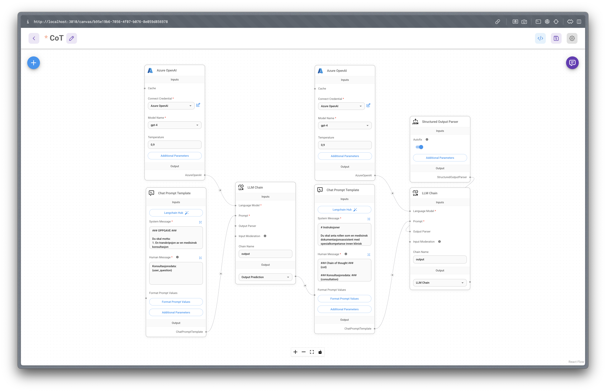

# Askeladden & Co x JrC Workshop 2025
The goal of this workshop is for you to solve a problem within a domain by leveraging AI

## Getting started
This skeleton app is set up with Vercel's AI SDK. It'll provide you with a good starting point to iterate on a full-stack AI solution. You're free to scratch the entire project if you'd rather use other technologies.

1. Add the `OPENAI_API_KEY` to `.env`. Ask us if you didn't receive it
2. Install dependencies: `pnpm install`
3. Run the app: `pnpm dev`

## About the app
NextJS + Vercel AI SDK + Shadcn + Tailwind

## How to run Flowise?
Flowise is a visual, drag-n-drop AI-chain editor - really good to iterate on chain design.

- `docker compose up`
- Open `localhost:3010`

---

## Resources
Here are some relevant resources that you can choose to leverage

### AI Chains
- Flowise
- LangChain
- Vercel AI SDK

### Wireframes / Landing page
- Figma
- Excalidraw
- Relume

### Idea generation
- v0